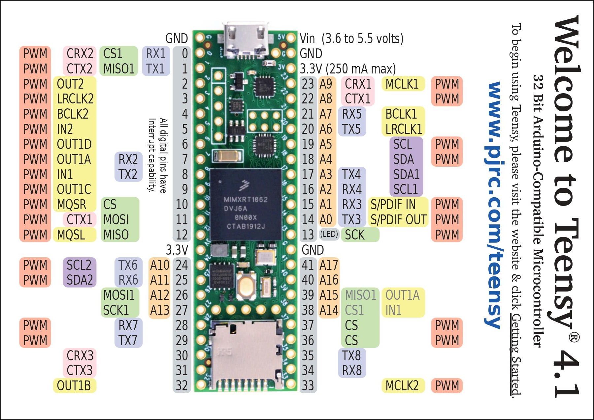

.. Loop Controller and Remote I/O documentation master file, created by
   sphinx-quickstart on Tue Feb 22 21:09:23 2022.
   You can adapt this file completely to your liking, but it should at least
   contain the root `toctree` directive.

Loop Controller and Remote I/O
=================================

The Project Overview
+++++++++++++++++++++

This project was concieved because of the high cost associated with industrial automation systems. Oftentimes, users at the Technician level desire more fine control of a process, generally in the form of analog I/O. The high cost of the analog I/O is not always justified, even if it would make the process run better or simplify troubleshooting. The primary objective of this project is to provide a simple solution that a technician could put together to give them more control of the process without breaking the bank. 

This project demonstrates how to build circuits that can interface with multiple types of industrial signals while using minimal hardware. These signals include:

* Inputs

  * 4-20mA
  * 0-10VDC
  * 0-5VDC
  * Digital I.E. (0 or 24VDC)

* Outputs

  * 4-20mA
  * 0-10VDC
  * 0-5VDC
  * Digital I.E. (0 or 24VDC)

* Relay

  * 24VDC up to 500mA
  * 120VAC with different relays EX `AQY217GSX <https://www.mouser.com/ProductDetail/Panasonic-Industrial-Devices/AQY217GSX?qs=T3oQrply3y8zWlBPtBcCgw%3D%3D>`_

* Temperature Instruments (TI)

  * Thermocouples (Type J, Type K, Type E, Type N, Type R, Type S, Type T, Type B)
  * RTD's (2-wire, 3-wire, 4-wire)

This project demonstrates how to use the API created for this project in a general way so as to apply it to any project, using CircuitPython as a base. The microcontroller picked for this purpose was the Teensy 4.1.

Further, the project demonstrates how to use a library called `pycomm3 library <https://docs.pycomm3.dev/en/latest/>`_ that allows the user to interface with CIP based protocol devices over ethernet. This library requires an OS to use, which is satisfied by the Onion Omega. 

This documentation is broken into multiple parts starting with the Hardware.

Hardware and Schematics
++++++++++++++++++++++++

Links to the hardware can be found below. These are the schematics that were used to build the intial protoboard for proof-of-concept. These schematics provide a base for circuits with multi-functionality in processing and creating analog and digital signals for industrial I/O. 

.. toctree::
   :maxdepth: 1
   :glob:
   :caption: Schematics

   schematics/inputcircuit
   schematics/outputcircuit
   schematics/ltc2984circuit
   schematics/powercircuit
   schematics/relaycircuit

Function of the Teensy
++++++++++++++++++++++++

The Teensy is the heart of the board. It controls all of the I/O as well as the PID calculations. It also handles the SPI communication to the LTC2984, which is used for temperature instruments. It also communicates through UART with the Onion Omega.

The Teensy 4.1 is capable of running at 600MHz, as well as being programmable through Circuit Python, which was used almost exclusively. 

Besides this, the Teensy 4.1 has a plethora of I/O available that was crucial to the project. Below is an image of the available I/O and a link to `PJRC <https://www.pjrc.com/store/teensy41.html>`_ for more information.

Function of Onion Omega
++++++++++++++++++++++++

This link provide information relative to the Onion Omega Controller. The Onion Omega is used as a data aggregate and can act as a wifi hotspot capable of allowing wireless access to the controller functionality. 

The `Omega <https://onion.io/omega2/>`_ was used because it runs an OS in the form of Linux, specifically a distribution called OpenWRT. This was necessary to utilize libraries that can access PLC's, specifically the `pycomm3 library <https://docs.pycomm3.dev/en/latest/>`_. There are other libraries capable of handling the same functionality, but the pycomm3 library was very simple to use. 

It is also capable of hosting a webpage, which with more work could simplify the users ability to adjust settings. For now, settings are adjusted by connecting to the Omega through the terminal. 

.. toctree::
   :maxdepth: 1
   :glob:
   :caption: Onion Omega Function

   Onion_Omega/*
   API_Examples/settings_text

.. toctree::
   :maxdepth: 1
   :glob:
   :caption: API Examples

   API_Examples/input_ex
   API_Examples/output_ex
   API_Examples/pid_ex
   API_Examples/ltc_ex
   API_Examples/shift_ex
   API_Examples/uart_ex
   API_Examples/settings_handler
   API_Examples/in_pid_out

.. toctree::
   :maxdepth: 1
   :glob:
   :caption: API References

   
   API_References/inputob
   API_References/outputob
   API_References/pidob
   API_References/ltc
   API_References/shift
   API_References/uart
   API_References/setting_ob

