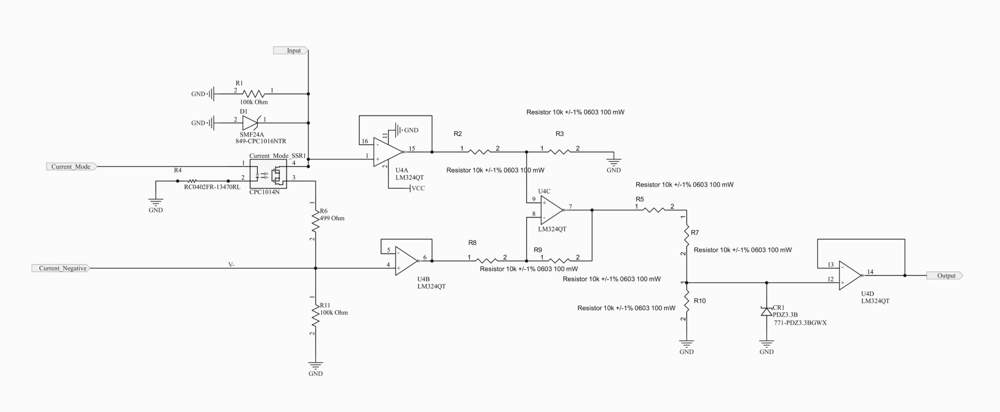

Input Circuit
=============

Below is the input circuit capable of 4-20mA, 0-10, 0-5, and 24VDC. 

Voltage Sensing Mode
---------------------
For 0-10, 0-5, and 24VDC the Current_Mode_SSR1 is off.
In this configuration, current will travel through the 100kOhm resistor. The voltage will be sensed at U4A.
At U4B, because of the pulldown 100kOhm resistor, the voltage will be 0V or very close to this. 
The configuration for the amplifiers is essentially an instrumentation amplifier. 

.. note:: 
   These amplifiers are capable of ground sensing which is paramount 
   if only connected to 24VDC and 0V. 

Current Sensing Mode
---------------------
For 4-20mA, the Current_Mode_SSR1 is on.
In this configuration, current will travel through the Current_Mode_SSR1. The voltage will be sensed at U4A and differentiated with the voltage at U4B. 
Because the current is bounded, the differences at 20mA will be ~10VDC due to Ohms Law. (.02*499)
At 4mA, the voltage difference will be ~2VDC. 

.. note:: 
   499 Ohms was selected because of the internal resistance of 
   the SSR and possible offsets. The ideal value is 500 Ohms from U4A to U4B.

Instrumentation Amplifier
--------------------------
The measured voltages go through buffers that then feed into the difference amplifier. Because of the configuration, there is a natural offset from feedback that comes from U4B. These offsets can be calibrated by the user to increase accuracy. 

Voltage Divider
----------------
Once the calculation has been made, the voltage is then divided by 3 through the voltage divider circuit. This is then pushed into the last buffer that then goes to the input pin of the Teensy 4.1.

