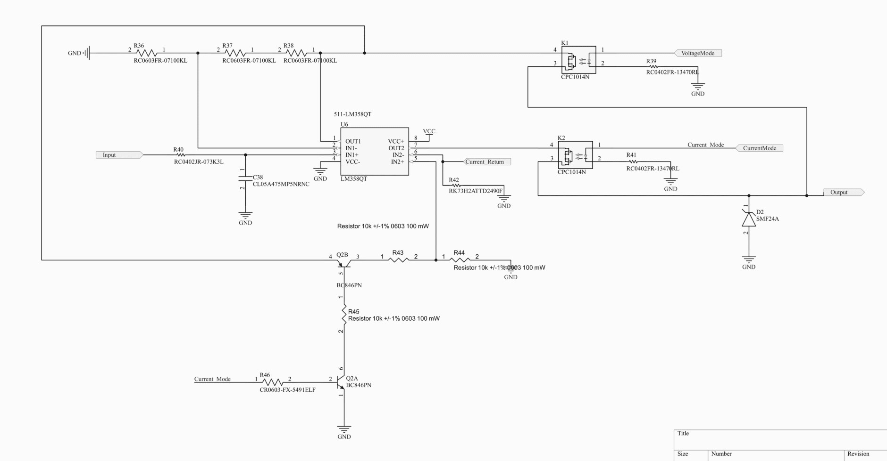

Output Circuit
==============

Theory of Operation
-------------------

The Pulse Width Modulated (PWM) has a peak of 3.3VDC. The PWM signal first goes through a Resistor-Capacitor (RC) circuit to help smooth out ripples. This filtered signal is fed into the LM358, and using a Non-Inverting Amplifier circuit with a gain of 3, the output voltage is amplified to the range appropriate for either 0-10VDC or for the 4-20mA circuit. 

Resistor-Capacitor Filter
-------------------------
The resistor selected was :math:`3.3k{\Omega}` and the capcitor selected was 4.7uF. This gives a :math:`{\tau}` of around 15.51ms and 77.55ms for :math:`5{\tau}`.

0-10VDC or 0-5VDC Operation
---------------------------
The scaled value from the Non-Inverting Amplifier is connected to a relay with the attached VoltageMode tag. When turned on, it will directly pass a 0-10VDC signal or 0-5VDC signal directly off of the amplifier.

4-20mA Operation
-----------------
When operating in 4-20mA mode, both a relay and a dual package NPN/PNP BJT transistor are turned on. The dual package BJT acts simply as a switch that controls the input path to the positive terminal for the 4-20mA amplifier.

The voltage produced from the Non-Inverting Amplifier goes through a simple voltage divider that halves the reference voltage into the positive terminal of the Op-Amp. This scaling was selected with consideration to the output ceiling of the amplifier. 

If the range of 0-10VDC was used, and the current loop used a :math:`500{\Omega}` resistor for it's current sensing, the voltage output required would be 20VDC which leaves little room for the 4-20mA amplifier to operate even though the amplifier is supplied with 24VDC. 
The output signal then comes back to the Current_Return tag, which gets sunk through the :math:`250{\Omega}` resistor. 

.. note:: :math:`249{\Omega}` is the actual value of the current sensing resistor for the current loop to account for resistances in the circuit.

With the voltage now scaled between 0-5VDC, the amplifier will try to adjust the output voltage to match the input voltage, which will force the voltage at the negative terminal to be the same as the positive terminal. 

If the voltage at the negative terminal is the scaled 5VDC, then the current through the :math:`250{\Omega}` resistor will be :math:`\frac{5}{250} = 20mA`. This means that an input of 1VDC will result in a 4mA output. 

Parts
-----
:download:`LM358QT Op Amp <datasheets/Output/LM358.pdf>`

:download:`CPC1002N Relay <datasheets/Output/CPC1002N.pdf>`

:download:`BCP846 NPN/PNP Dual Package BJT <datasheets/Output/BCP846.pdf>`

